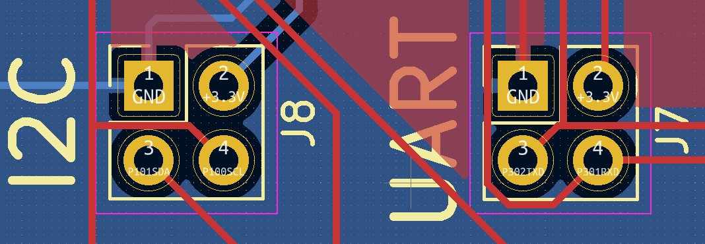

# Arduino UNO R4 もどき

## 買ったもの

- [これ(WeActStudio RA4M1)](https://ja.aliexpress.com/item/1005006103872563.html)の3.3V版
- 基板作ったけどピン数間違ってた
    - 3V3,206,408,409の4本はつないじゃダメ
    - LCDとI2C(J8)とUART(J7)は使えた

## Arduino化

- [Arduino公式のダウンロードページ](https://github.com/arduino/ArduinoCore-renesas/tree/main/bootloaders/UNO_R4)からファームウェア(dfu_minima.hex)をダウンロード
- [Renesas公式のダウンロードページ](https://www.renesas.com/us/en/software-tool/renesas-flash-programmer-programming-gui)からFlash Programmerをダウンロードしてインストール
    - ユーサー登録が必要だった
- [ここ](https://community.element14.com/products/arduino/b/blog/posts/arduino-uno-r4-minima-troubleshooting-unknown-usb-device)のReflash the Bootloader以降に従ってファームウェアを書き込む
    - USBでつなぐ
    - MDボタンを押しながらリセットを押してからはなす（そのあとでMDボタンをはなす）×2回？
        - UARTが生えてくるので番号を覚えておく
    - Flash Programmer起動
        - Connect Settings tabでUARTを選ぶ
        - dfu_minima.hexを読み込む
        - 新しいプロジェクトを作ってセーブ
        - Startを押す (書き込む)
- Example Blinkで確認
    - LED_BUILTINはこのボードにはついていない
    - LED_BUILTINをLED_TXに変更すると動いた（3か所）
- 他にも[サンプルがある](https://github.com/arduino/ArduinoCore-renesas/tree/main/libraries)

## OLED 表示
- SSD1306を使っている[128x32 OLED LCD](https://ja.aliexpress.com/item/32850288143.html)に表示する
- [ここ](https://101010.fun/iot/arduino-oled-display.html)を参考にした
- u8g2ライブラリをインストールする
- GND-＞GND:VCC-＞VCC:100->SCK:101->SDA につなぐ
- OLED.ino を書き込む

## 温室気圧・CO2濃度計
BME280とMH-Z19をつないで温度・湿度・気圧と二酸化炭素濃度を表示する  
5V電源がないので外部から持ってくる（GNDに注意！！）
- インストールするライブラリ
    - u8g2
    - SparkFun BME280
    - Mzh19 by Eduard
- ピン配は以下の図を参照
- weather.inoを書き込む

